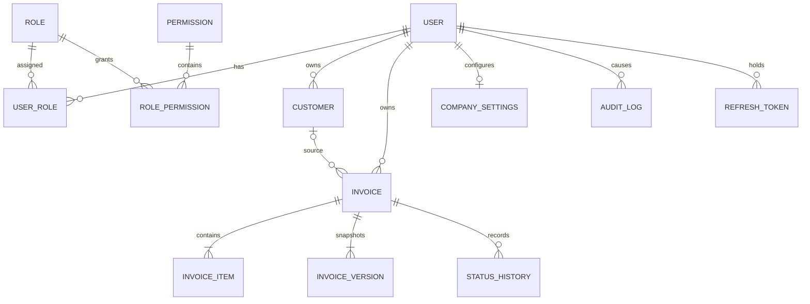

# Rechnungswerk – Architektur

Stand: 11. September 2026 · Status: verbindliche Grundlage für die Implementierung

## 1. System und Technologien

Rechnungswerk ist ein modularer Monolith in einem pnpm-Monorepo. Der Ansatz hält lokale Entwicklung und Betrieb einfach, wahrt aber klare Modulgrenzen für eine spätere Aufteilung.

| Ebene | Entscheidung | Begründung |
| --- | --- | --- |
| Web | Vue 3.5, Vuetify 4.1, TypeScript, Composition API, Pinia, Vue Router, Vite | aktuelle stabile UI-Basis, starke Accessibility- und Responsive-Komponenten |
| API | Node.js 24, NestJS 11, TypeScript | klare Module, Guards, Validation Pipes und testbare Services |
| Daten | PostgreSQL 17, TypeORM 0.3, explizite Migrationen | ACID-Transaktionen, relationale Constraints, gut kontrollierbare SQL-Migrationen |
| Geld | ganzzahlige Minor Units (`bigint`) und Basis-Punkte | keine binären Floating-Point-Fehler; deterministische Rundung |
| Dokumente | gemeinsames Render-Modell, PDFKit und `docx` | PDF und DOCX nutzen dieselbe normalisierte Daten- und Stildefinition |
| Export | Archiver, Streaming-Antworten | Einzel- und Batch-ZIPs ohne große Arbeitsspeicher-Spitzen |
| Betrieb | Docker Multi-Stage Builds, Compose, Nginx, Healthchecks | reproduzierbarer Development- und Production-Start |

## 2. Projektstruktur

```text
apps/
  api/                 NestJS-Anwendung
    src/modules/       Fachmodule (auth, invoices, customers, users, documents, audit)
    src/database/      Entities, Migrationen, Seeds
  web/                 Vue-/Vuetify-Anwendung
    src/components/    wiederverwendbare UI-Bausteine
    src/views/         routenbezogene Ansichten
packages/
  shared/              API-Verträge, Geld- und Status-Typen
docs/                  Architektur, API und Betriebsdokumentation
docker/                Nginx- und Container-Konfiguration
```

## 3. Datenmodell und Beziehungen

Mandantengrenze ist in der ersten Version der Benutzerbesitz: normale Benutzer sehen nur eigene Kunden, Einstellungen und Rechnungen; Administratoren dürfen systemweit verwalten. Die Policy-Schicht ist zentral, damit später ein `Organization`-Mandant ergänzt werden kann.



Wichtige Constraints:

- E-Mail-Adressen und Rechnungsnummern sind eindeutig.
- Versionen sind pro Rechnung über `(invoiceId, versionNumber)` eindeutig.
- Beträge sind `bigint` in der kleinsten Währungseinheit; Mengen sind `numeric(14,4)`.
- Rabatt und Steuersatz sind Basis-Punkte (`10000 = 100 %`) mit Check-Constraints.
- Kunden- und Firmendaten werden als JSON-Snapshot in die Rechnung kopiert.
- `currentVersion` ermöglicht optimistische Nebenläufigkeitskontrolle.
- `deletedAt`, `deletedById` und `purgeAfter` bilden den Papierkorb ab.
- `searchText` erhält einen PostgreSQL-Trigramm-Index für performante Teiltextsuche.

## 4. Authentifizierung und Berechtigungen

- Passwörter werden mit Argon2id und serverseitig begrenzten Eingabegrößen gehasht.
- Kurzes Access-JWT (15 Minuten) und rotierendes Refresh-Token (7 Tage) liegen in `HttpOnly`, `Secure`-fähigen, `SameSite=Lax`-Cookies.
- Refresh-Tokens werden nur als SHA-256-Hash gespeichert und bei Rotation widerrufen.
- Zustandsändernde Requests benötigen zusätzlich ein Double-Submit-CSRF-Token (`X-CSRF-Token`).
- Ein globaler JWT-Guard schützt standardmäßig alle Routen; `@Public()` ist eine explizite Ausnahme.
- `@Permissions()` plus serverseitiger Ownership-Check erzwingen RBAC und Datengrenzen unabhängig von der Oberfläche.
- Rollen und Berechtigungen sind relationale Datensätze, nicht hart codierte UI-Schalter. Seeds liefern `Administrator` und `Benutzer`.
- Login und Auth-Endpunkte besitzen ein strengeres Rate Limit; ein globales Limit schützt die übrige API.

## 5. Rechnungsversionierung

Jeder fachlich relevante Schreibvorgang läuft in einer Datenbanktransaktion:

1. Rechnung samt Positionen sperren bzw. erwartete Version prüfen.
2. Eingaben validieren und alle Geldwerte serverseitig neu berechnen.
3. aktuellen Datensatz und Positionen aktualisieren.
4. vollständigen kanonischen Post-State als unveränderlichen JSON-Snapshot mit fortlaufender Versionsnummer speichern.
5. Statushistorie und Audit-Event im selben Commit schreiben.

Finalisierte, versendete, bezahlte und stornierte Rechnungen verlangen bei Inhaltsänderungen einen Änderungsgrund. Keine alte Version wird überschrieben. „Wiederherstellen“ kopiert einen alten Snapshot als neue Version; die Historie bleibt lückenlos. Ein `expectedVersion` verhindert Lost Updates.

## 6. PDF- und Word-Erzeugung

`InvoiceDocumentModel` ist das formatneutrale Zwischenmodell. Ein Template-Resolver lädt Design-Tokens und normalisiert Absender, Empfänger, Positionen, Summen und Fußzeile. Zwei Renderer konsumieren exakt dieses Modell:

- PDFKit: wiederholte Tabellenköpfe, kontrollierte Seitenumbrüche, Seitenzahlen.
- `docx`: feste Spaltenbreiten, wiederholte Header Rows, `cantSplit` für Positionen, identische Typografie und Abstände soweit Word dies unterstützt.

Renderer laufen ausschließlich serverseitig. Downloads werden über autorisierte ID-basierte Endpunkte erzeugt, erhalten sichere Dateinamen und `Content-Disposition: attachment`. Batch-Exporte werden sequenziell in ZIP-Streams geschrieben und sind auf 100 Rechnungen begrenzt.

## 7. Backup, Archiv und Löschung

- Rechnungen werden nur soft-gelöscht. `purgeAfter = deletedAt + 30 Tage` ist sichtbar und indiziert.
- Wiederherstellen löscht die drei Papierkorb-Felder und erzeugt Audit- und Versionsereignisse.
- Ein täglicher Job entfernt abgelaufene Datensätze in kleinen Transaktions-Batches; Administratoren können denselben berechtigten Vorgang anstoßen.
- Backups: tägliches verschlüsseltes `pg_dump --format=custom`, sieben tägliche, vier wöchentliche und zwölf monatliche Stände; quartalsweise Restore-Probe.
- Produktiv sollten rechtliche Aufbewahrungsregeln als eigene Retention-Policy aktiviert werden. Die geforderte 30-Tage-Löschung ist die technische Standardkonfiguration.

## 8. API-Struktur

Basis: `/api/v1`, JSON, UTC-Zeitstempel in ISO 8601.

| Bereich | Endpunkte (Auszug) |
| --- | --- |
| Auth | `POST /auth/login`, `POST /auth/refresh`, `POST /auth/logout`, `GET /auth/me` |
| Rechnungen | `GET/POST /invoices`, `GET/PATCH/DELETE /invoices/:id`, `POST /:id/duplicate`, `POST /:id/restore` |
| Versionen | `GET /:id/versions`, `GET /:id/versions/:version`, `POST /:id/versions/:version/restore` |
| Status | `POST /invoices/:id/status` |
| Dokumente | `GET /invoices/:id/documents/:format`, `GET /invoices/:id/export`, `POST /invoices/batch-export` |
| Kunden | `GET/POST /customers`, `GET/PATCH /customers/:id`, `POST /customers/:id/archive` |
| Betrieb/Admin | `GET /dashboard`, `GET /trash`, `GET/POST /users`, `GET /audit-logs`, `GET /health` |

Listen verwenden `page`, `pageSize` (maximal 100), `sortBy`, `sortOrder` und fachliche Filter. Fehler folgen `{ statusCode, code, message, details, requestId, timestamp }`. DTO-Validierung verwirft unbekannte Felder.

## 9. UX-Konzept

- Desktop: permanente Navigation, datenreiche Tabellen, geteilte Editor-/Vorschauansicht.
- Tablet: einklappbare Navigation, kompakte Tabelle bzw. Zwei-Spalten-Formular.
- Smartphone: Bottom Navigation, Rechnungs-Cards statt verkleinerter Tabellen, schrittweiser Editor und fixierte Primäraktion.
- Dashboard mit echten Kennzahlen, überfälligem Betrag, letzter Aktivität und prominenter Schnellaktion.
- Editor mit Kunden-Autocomplete, automatisch berechneten Positionen, Inline-Validierung und Schutz vor ungespeicherten Änderungen.
- Skeletons, fachliche Empty States, Snackbar-Feedback, Undo nach Soft Delete, Bestätigungsdialoge für irreversible Aktionen.
- Tastaturfokus, ARIA-Beschriftungen, 44px-Touch-Ziele, Kontrast nach WCAG 2.2 AA und systemweites Hell-/Dunkel-Schema.

## 10. Sicherheitskonzept

- Helmet mit restriktiven Headern; Nginx ergänzt HSTS in TLS-Umgebungen.
- Globale Eingabevalidierung, Längenlimits, UUID- und Enum-Prüfung; keine ungefilterten Sortier- oder SQL-Fragmente.
- Vue escaped Inhalte standardmäßig; kein `v-html` für Benutzerdaten.
- CSRF-, Origin- und Cookie-Policy; CORS nur für die konfigurierte Origin.
- Autorisierung im Controller und Service, um auch interne Aufrufe abzusichern.
- Konstante Login-Fehlerantworten verhindern Benutzeraufzählung.
- Audit-Metadaten sind allowlist-basiert; Tokens, Passwörter und Dokumentinhalte werden nie geloggt.
- Export-IDs werden gegen Ownership/RBAC geprüft; Dateinamen werden normalisiert.
- Container laufen als Non-Root, besitzen Read-only Root-Filesystem-Kompatibilität und getrennte persistente Volumes.
